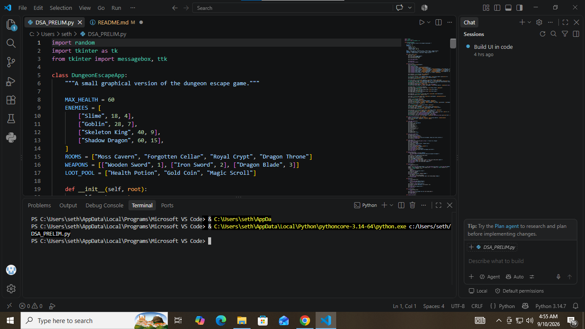
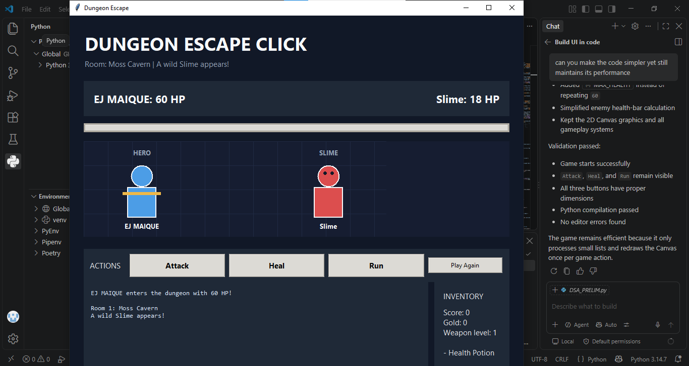

GAME TITLE : DUNGEON ESCAPE CLICK
GAME DESCRIPTION : IT IS A SIMPLE CLICK GAME, WHERE YOU TRY TO ESCAPE THE DUNGEON THROUGH FIGHTING VARIOUS ENEMIES
TEAM ROLES : GAME PRODUCER / TEAM LEADER = MAIQUE, ELIEZR EJ A.
             LEAD GAME PROGRAMMER : MAIQUE, ELIEZR EJ A.
             GAMEPLAY AND LOGIC PROGRAMMER = LAPAD, YOUNG LEE C.
             GAME / UI DESIGNER AND WRITER = LUCAGBO, ANNELIESE P. AND CLOMA, INGRID
             QA TESTER AND DOCUMENTATION LEAD = LACARAN, JAMES ; MOCSANA, MOHAMMED HUSSIEN & LAPAD, YOUNG LEE C.

LIST OPERATIONS

1. LIST CREATION
ENEMIES = [["Slime", 18, 4], ["Goblin", 28, 7], ...]      # list of lists
ROOMS = ["Moss Cavern", "Forgotten Cellar", ...]
WEAPONS = [["Wooden Sword", 1], ["Iron Sword", 2], ...]
LOOT_POOL = ["Health Potion", "Gold Coin", "Magic Scroll"]
self.inventory = ["Health Potion", "Wooden Sword"]
self.battle_history = []
self.loot_history = []

2. INDEXING / NESTED INDEXING (CREDITED TO AI)
self.ENEMIES[self.enemy_index]          # get enemy record
enemy_record[0], enemy_record[1], enemy_record[2]
self.ROOMS[self.enemy_index]
self.WEAPONS[1][0], self.WEAPONS[1][1]  # nested list indexing
self.ENEMIES[self.enemy_index][1]

3. len()
self.enemy_index >= len(self.ENEMIES)
len(self.inventory)

4. .append()
self.inventory.append(drop)
self.battle_history.append(self.enemy_damage)
self.loot_history.append(drop)
self.inventory.append(self.WEAPONS[1][0])
self.inventory.append(self.WEAPONS[2][0])

5. .remove()
self.inventory.remove("Health Potion")

6. sorted()

sorted(self.battle_history, reverse=True)

7. random.choice() ON A LIST
random.choice(self.LOOT_POOL)

8. ITERATION (for ... in)
for item in self.inventory:

SCREENSHOTS: 

